<div align="center">

# 🌳 Wiki Tree

**把一堆杂乱的本地文档，一键变成结构化、可浏览、可被 AI 检索的知识库**
*Turn a folder of mixed local documents into a structured, browsable, agent‑queryable knowledge base.*

[](LICENSE)
[](#-依赖)
[](#-这是什么)
[](https://obsidian.md)
[](#-跨运行时调用access-bundle)

</div>

---

## 📖 这是什么

**Wiki Tree** 是一个 **Agent Skill**（基于 `SKILL.md`，可被 Claude Code / Claude Agent SDK 等运行时调用）。给它一个塞满 Word / PDF / Markdown / 笔记的文件夹，它会：

1. 扫描并标准化为 Markdown；
2. 用 LLM 抽取**实体 · 关系 · 主题**与两层摘要；
3. 装配成一个 **Obsidian 兼容的知识库**——实体卡片、`[[wikilink]]` 双链、知识图谱、`文档 → 主题 → 全局` 三层摘要；
4. 吐出一套**接入包**（`kb_query` CLI + MCP server），让**任意 AI agent 跨运行时检索**这棵知识树。

> 灵感来自 OpenHuman 的 Memory Tree，但**完全本地化、原生支持中文文档**。
> 不是简单丢进向量库——它给你的是**带出处、可浏览、分层下钻**的结构化知识，人看得懂、agent 查得到。

---

## ✨ 特性

| | 特性 | 说明 |
|---|---|---|
| 📥 | **多格式摄取** | `.docx` `.pdf` `.md/.markdown/.mdx` `.json` `.csv` `.txt/.text/.log`，不支持的自动跳过并记录 |
| 🧠 | **记忆抽取** | 每篇抽实体 / 关系 / 主题 + 短摘要 + 详细摘要；**确定性闸门**（`verify_entities`）过滤幻觉实体 |
| 🕸️ | **知识图谱** | 按 `(主语,谓语,宾语)` 聚合去重；中心度排名核心实体；生成 `_knowledge-graph.md` |
| 📚 | **分层摘要** | `L0 原文 → L1 主题摘要 → L2 全局摘要`，由粗到细、够用就停 |
| 🔗 | **Obsidian 原生** | 实体卡片 + `[[kind-名]]` 双链 + 图谱配色；**wikilink 只指向已建卡实体 → 天然零悬空** |
| ♻️ | **增量复跑** | `manifest` 为唯一真相源，只处理 `new/modified`；>100 篇自动分批、下一轮补齐，不重不漏 |
| ⚡ | **并行抽取** | 宿主支持子 agent 时按批 fan‑out，单写入者登记 manifest，突破"单上下文塞不下上百篇全文" |
| 🤖 | **接入包 / 可被检索** | `kb_query` 四档下钻 CLI + 每库 MCP server + 全局 registry + MCP 中枢，**一次构建、处处可调** |
| 🚦 | **入库路由** | `kb_ingest.py` 给散落新文件按 IDF 匹配自动判库，confirm/auto 两模式，写前可确认 |

---

## 🔧 工作原理

```mermaid
flowchart LR
    A["📁 混杂文档<br/>docx · pdf · md · json · csv · txt"] --> B["扫描评估<br/>scan_folder"]
    B --> C["转 Markdown<br/>convert_documents"]
    C --> D["记忆抽取 · LLM<br/>实体 / 关系 / 主题 / 摘要"]
    D --> E["去重 + 中心度<br/>suggest_dedup · compute_centrality"]
    E --> F["装配 Vault<br/>assemble_vault<br/>实体卡 · 知识图谱 · 索引"]
    F --> G["分层摘要 · LLM<br/>L0 文档 → L1 主题 → L2 全局"]
    G --> H["📚 Obsidian Vault"]
    H --> I["接入包<br/>emit_access_bundle<br/>kb_query CLI + MCP"]
    I --> J["🤖 任意 agent<br/>跨运行时检索"]
```



**确定性活交脚本、语言活交 LLM**：扫描 / 转换 / 中心度 / 装配 / 索引由脚本保证幂等可重跑；实体语义去重、主题/全局摘要、叙述性散文由 LLM 完成。所有抽取结果落 `.wiki-tree/extracted/*.json` 做持久缓存，reduce 永远从其全集重建图谱。

---

## 🚀 快速开始

### 作为 Agent Skill（推荐）

把本仓库放进运行时的技能目录（如 `~/.claude/skills/wiki-tree`），然后用自然语言触发：

```text
把 D:/我的资料 这个文件夹整理成知识库
帮我建一个 Obsidian Wiki / 第二大脑
扫描这个文件夹，提取里面的知识，做成 agent 能查的库
```

Agent 会按 `SKILL.md` 的 9 个 Phase 自动编排：扫描 → 转换 → 抽取 → 建图 → 摘要 → 产出 Vault → 吐接入包。

### 手动跑确定性管线

```bash
# 1. 扫描（增量复跑加 --vault）
python scripts/scan_folder.py <目标文件夹> -o <vault>/.wiki-tree/scan.json
# 2. Vault 骨架（.obsidian 配色 / 模板 / .wiki-tree 底座；缺失才建，重跑不覆盖）
python scripts/generate_wiki_structure.py --output <vault>
# 3. 转 Markdown
python scripts/convert_documents.py --scan-report <vault>/.wiki-tree/scan.json --output <vault>
#    ──（抽取：agent 读 documents/ 按 references/extraction-prompts.md 第 1-3 节写 .wiki-tree/extracted/*.json；
#       摘要：按第 4/5 节写 summaries/topic-*.md 与 _global-summary.md——emit 的主题/全局档依赖它们）──
# 4. reduce：中心度 + 装配
python scripts/compute_centrality.py --vault <vault> -o <vault>/.wiki-tree/centrality.json
python scripts/assemble_vault.py     --vault <vault>
# 5. 接入包（让 agent 可检索）
python scripts/emit_access_bundle.py --vault <vault> --id <kebab-id> --name "库名" --scope "一句话简介"
```

> 然后用 Obsidian「打开文件夹作为仓库 / Open folder as vault」选中 `<vault>` 即可浏览图谱与双链。

---

## 📂 产出结构

```text
<vault>/                       ← 这个文件夹本身就是一个 Obsidian Vault
├── _index.md                  # 全局索引（全局摘要 + 主题列表 + 统计）
├── documents/                 # L0：标准化后的原始文档
├── summaries/                 # L1 主题摘要 + L2 _global-summary.md
├── entities/                  # 实体卡片（person- / project- / concept- …）
├── relations/_knowledge-graph.md
├── kb.json · AGENTS.md · .mcp.json · kb_query.py · kb_mcp_server.py   # 接入包
└── .wiki-tree/                # 元数据：extracted/ · manifest.json · search-index.json · centrality.json
```

---

## 🔌 跨运行时调用（Access Bundle）

> 目标：**一次构建，处处可调**。任何项目、任何运行时（Claude Code / Codex / OpenClaw / Hermes）的 agent 都能发现并检索这棵树。

- **四档下钻** `kb_query.py`：`--global`（L2 全局）→ 主题摘要（L1）→ `--level detailed`（逐文档详细摘要）→ `--level full`（L0 原文）。检索默认返回主题摘要 + 候选文档路径，按需深入、够用就停。
- **每库 MCP**：`kb_mcp_server.py` + `.mcp.json`，支持 MCP 的端自动出现 `kb_search` / `kb_topic` / `kb_document` 工具。
- **全局 registry + MCP 中枢**：`kb_register.py` 把库登记到 `~/.knowledge-bases/registry.json`；`kb_hub_server.py` 读 registry 把**本机所有库**暴露为一组 MCP 工具，装一次、新增库零配置。
- **能力分层**：CLI 是通用底座（凡能跑 shell 即可用），MCP 为自动发现增强 —— 两者叠加，通用性最大。

---

## 🧰 脚本一览

| 脚本 | 作用 | 性质 |
|---|---|---|
| `scan_folder.py` | 扫描分类 + 增量判定（manifest） | 确定性 |
| `convert_documents.py` | 多格式 → Markdown | 确定性 |
| `verify_entities.py` | 幻觉防护：过滤未在原文出现的实体 | 确定性 |
| `suggest_dedup.py` | 给出确定性去重候选（线索，不下结论） | 确定性 |
| `compute_centrality.py` | 实体中心度排名 | 确定性 |
| `assemble_vault.py` | 回填索引 / 知识图谱 / 实体卡骨架 | 确定性 |
| `generate_wiki_structure.py` | 脚手架模板（缺失才建，重跑不覆盖） | 确定性 |
| `update_manifest.py` | 登记 `done`（逐篇 / 批量 / 转换报告） | 确定性 |
| `emit_access_bundle.py` | 生成 `kb.json` / `AGENTS.md` / `.mcp.json` / 检索索引 | 确定性 |
| `emit_doc_summaries.py` | 可选：逐文档摘要落 `summaries/doc-*.md` | 确定性 |
| `kb_register.py` | 登记到全局 registry（可选装 hook） | 确定性 |
| `templates/kb_query.py` · `kb_mcp_server.py` · `kb_hub_server.py` · `kb_ingest.py` | 接入包 / 中枢 / 入库路由模板 | 确定性 |

---

## 📦 依赖

```bash
python -m pip install python-docx   # 仅当含 .docx
python -m pip install PyMuPDF       # 仅当含 .pdf
python -m pip install "mcp[cli]"    # 仅当要挂 MCP 服务（kb_hub_server / kb_mcp_server）；CLI 查询不需要
```

一键装全：`python -m pip install -r requirements.txt`；不确定缺什么先跑 `python scripts/check_deps.py` 自检（纯标准库，报告各可选依赖在/缺 + 缺的装啥）。

纯 Markdown / JSON / Text / CSV 语料**无需任何第三方库**。Python 3.8+。

---

## ❓ FAQ

- **文件太多？** 自动分批、>100 篇优先最近修改的 100 个，下一轮增量复跑（`--vault`）按 manifest 自动补齐，不重不漏；宿主支持子 agent 时可并行 fan-out 加速。
- **会改原始文件吗？** 不会，只在输出目录新建文件。
- **扫描版 PDF？** 1.0 暂不内置 OCR；图片型 PDF 提取为空时会在转换报告中单列标记，不会静默当成功。
- **用 Obsidian 怎么打开？** 输出目录本身就是 Vault——「打开文件夹作为仓库 / Open folder as vault」选中它即可；不存在也不需要叫 `Vault` 的子文件夹。
- **没装 Obsidian？** 输出目录就是普通文件夹，`.md` 任何编辑器都能看，只是没有图谱/双链可视化。
- **LLM 调用会不会很多？** 每篇 2-3 次（实体提取 + 摘要 + 可选关系抽取），100 篇约 200-300 次；建议用低成本模型。

---

## 📄 License

[MIT](LICENSE) · 灵感致谢 OpenHuman Memory Tree。
