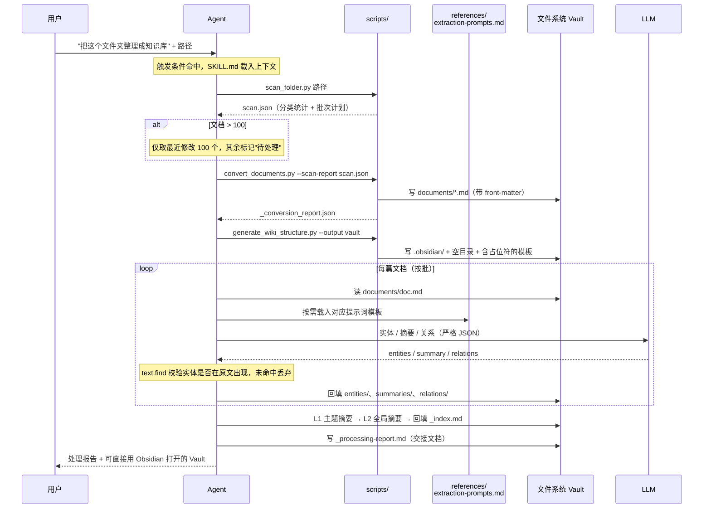
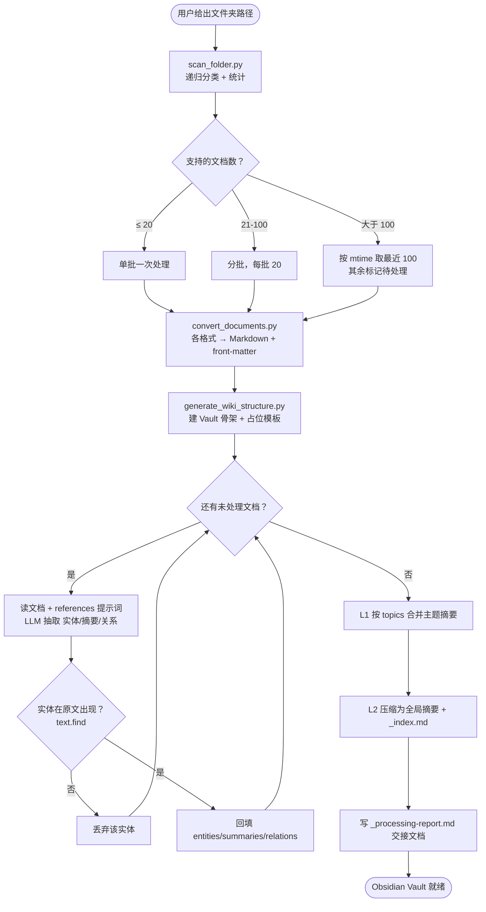

> **电梯演讲**：把一盘散沙的本地文档，用「脚本干体力活、LLM 干理解活」的清晰分工，一键长成一座能在 Obsidian 里漫游的知识图谱——并通过"交接文档即记忆"的设计，让无状态的 Agent 也能半夜增量自更新。

# howSkill 分析报告：local-memory-wiki

> 分析对象：`D:\AI_Project\Skills\skills\local-memory-wiki`
> 分析视角：产品设计意图（为什么这样设计），而非功能复述。

---

## 第一阶段：Skill 结构扫描

### 目录结构

```
local-memory-wiki/
├── SKILL.md                              351 行 / 10.5 KB   ← 工作流主指令（重）
├── references/
│   └── extraction-prompts.md             199 行 / 4.5 KB    ← 5 套 LLM 提示词模板
├── scripts/
│   ├── scan_folder.py                    169 行 / 5.2 KB    ← 扫描分类 + 批次计划
│   ├── convert_documents.py              260 行 / 7.8 KB    ← 多格式 → Markdown
│   └── generate_wiki_structure.py        220 行 / 5.8 KB    ← 生成 Vault 骨架 + 占位模板
└── .DS_Store                             （macOS 残留，非设计资源）
```

### 资源构成

| 资源类型 | 数量 | 规模 | 说明 |
|----------|------|------|------|
| SKILL.md | 1 | 351 行 | 指令偏重，含 8 阶段工作流 + schema 表 + 示例 |
| scripts/ | 3 | 649 行 | 全部为确定性 Python，覆盖"扫描→转换→脚手架" |
| references/ | 1 | 199 行 | 纯提示词模板，按需加载 |
| assets/ | 0 | — | 无静态资产（但有"代码生成的模板"，见第六阶段） |

### Skill 类型判断

**混合型（以"流程编排"为骨架，"工具集成"为手脚，"轻知识"为弹药）。**

证据：
- **流程编排**：SKILL.md 定义了严格的 8 阶段线性流水线（`SKILL.md:46-298`）。
- **工具集成**：3 个 Python 脚本承担确定性操作，且彼此用文件管道串联（`scan.json` 是 `convert_documents.py` 的输入，`convert_documents.py:206`）。
- **轻知识**：references 存放 5 套提示词模板，是 LLM 步骤的"弹药库"。

它**不是**纯轻量知识型（有可执行脚本），也不是纯工具集成型（核心语义步骤交给 LLM 而非脚本）。

---

## 第二阶段：真实痛点挖掘

> 以下结论基于实现细节反推，不引用 description。

### 2.1 场景还原

- **目标用户**：手里攒了一堆杂乱本地文档（会议记录 .docx、论文 .pdf、笔记 .md、导出数据 .json）、希望"沉淀成可检索知识"但又不想手动整理的个人/知识工作者。
- **没有这个 Skill 会怎样**：Agent 面对一个文件夹时，①根本读不了 .docx/.pdf 这类二进制（需要专门库），②就算逐个读，几十上百个文档的全文会瞬间撑爆上下文，③即便勉强提取，每次输出格式都不一样、实体会被编造、产物是一堆散落 markdown 而非可导航的知识库。
- **它解决的不是**"读文档"这件表面事，而是**"把异构、超量、易失真的原始资料，稳定地收敛成一个人类可直接漫游、且能持续增量维护的知识资产"**——痛点在"稳定/可持续/可消费"，不在"能不能读"。

### 2.2 痛点细化

| # | 痛点描述 | Skill 中对应的解法线索 |
|---|----------|----------------------|
| 1 | Agent 无法原生读取 .docx/.pdf 二进制，且每种格式提取逻辑不同，逐个手写既贵又不可复现 | `convert_documents.py` 内置 5 个格式转换器（word/pdf/json/text/md），text 转换器还带 GBK 回退（`convert_documents.py:114-119`） |
| 2 | 上百个文档的全文塞不进上下文窗口，盲目处理会爆 token 或半途失败 | `scan_folder.py` 按规模分级出批次计划（≤20/21-100/>100，`scan_folder.py:101-131`）；Phase 6 用 L0→L1→L2 三级摘要压缩（`SKILL.md:190-203`） |
| 3 | 实体/关系抽取正是 LLM 最爱"编造看似合理事实"的环节，一个幻觉实体就污染整张图谱 | `text.find()` 校验实体是否在原文出现，未命中即丢弃（`SKILL.md:151`）；提示词反复强调"不要编造/只提取有明确证据的关系"（`extraction-prompts.md:64,107`） |
| 4 | 知识库是活的，重复全量重跑既慢又会产生重复；而被 cron 唤醒的新 Agent 对上次处理一无所知 | 增量时间戳 + 跳过已存在文件 + 交接文档 `_processing-report.md`，"下一个被激活的 Agent 读交接文档不重复处理"（`SKILL.md:302-316`） |
| 5 | 把事实抽成一坨 JSON 对人毫无用处——价值在于"能不能立刻打开来用" | 产物是完整 Obsidian Vault：`graph.json` 着色、`[[entity-张三]]` wikilink、front-matter 标签（`generate_wiki_structure.py:17-52`、`SKILL.md:244-257`） |

---

## 第三阶段：工作流程可视化

### 3.1 用户交互时序图



要点：SKILL.md 在触发时整体载入；scripts 在"扫描/转换/脚手架"三个确定性节点被调用；references 仅在循环内的 LLM 抽取节点按需载入；产物是文件系统里的 Vault，而非聊天框里的文字。

### 3.2 核心工作流程图



流程有真实的**分支**（规模分级）、**循环**（逐文档抽取）、**判断节点**（幻觉闸门），故保留流程图。

---

## 第四阶段：Scripts 脚本设计拆解

### 4.1 功能原子化程度

| 脚本文件 | 核心功能 | 是否单一职责 | 可复用性评估 |
|----------|----------|-------------|-------------|
| `scan_folder.py` | 递归扫描、按扩展名分类、出批次计划 | ✅（扫描+计划高内聚） | 高：表驱动 `SUPPORTED_EXTENSIONS`（`:14-30`），换场景只改表 |
| `convert_documents.py` | 多格式统一转 Markdown + 盖 front-matter | ✅ | 高：`CONVERTERS` 注册表（`:137-143`），加格式=加一个函数 |
| `generate_wiki_structure.py` | 仅生成 Vault 目录与占位模板 | ✅（显式声明不做抽取 `:6-7`） | 高：模板与结构集中，易改版式 |

### 4.2 场景覆盖分析

- **覆盖的典型场景**：Word/PDF/Markdown/JSON/Text 五类；中英文混排；UTF-8 失败回退 GBK（`convert_documents.py:114-119`）；同名文件自动加序号去重（`convert_documents.py:157-160`）；扫描时跳过 `node_modules/.git/.obsidian` 等噪声目录（`scan_folder.py:60-63`）。
- **显式处理的边界**：JSON 递归展开为标题/正文（`convert_documents.py:82-106`）；PDF 逐页加页码注释（`convert_documents.py:61-65`）；缺库时返回友好注释而非崩溃（`convert_documents.py:21-22,55-56`）。
- **覆盖盲区**：①扫描版 PDF 无 OCR（文档已诚实承认，`SKILL.md:326-328`）；②文档级去重缺失（只有实体去重，且交给 Agent）；③`.csv` 在脚本里被当 text 直接读（`scan_folder.py:29`），不解析表格结构；④**增量/cron 逻辑（`_last_processed_at.txt`、跳过已处理）在任何脚本中都未实现**——见第八阶段。

### 4.3 流程编排设计

- **调用顺序依赖**：严格三段 `scan → convert → scaffold`，且 `convert_documents.py` 以 `scan_folder.py` 的产物 `scan.json` 为输入（`--scan-report`，`convert_documents.py:206`）——**用文件做管道契约**，每段产物可单独检视。
- **Agent 如何被引导选脚本**：靠 SKILL.md 的 Phase 编号 + 每个脚本 docstring 里的"用法"行（如 `scan_folder.py:4`）。命名即语义（scan/convert/generate），降低误用。
- **接口对 Agent 是否友好**：✅ 全部 argparse、清晰长短 flag、JSON 输入输出、`--output` 可选 stdout/文件（`scan_folder.py:159-165`），便于 Agent 解析与链式调用。

### 4.4 "确定性"价值分析

- **被脚本固化为确定性的任务**：文件遍历分类、批次计划、格式→Markdown、front-matter 盖戳、Vault 目录与配置生成。这些"做一万次都应一样"的体力活，绝不让 Agent 即兴写代码。
- **最关键的场景**：①**避免幻觉**（分类/转换若让 LLM 来做会瞎编内容）；②**可复现**（增量重跑产物一致）；③**省 token**（机械活不耗推理）。`generate_wiki_structure.py:6-7` 一句注释点破全局哲学——脚本只搭骨架，语义留给 LLM。

---

## 第五阶段：References 参考文档设计拆解

### 5.1 知识分层设计

- **放进 SKILL.md 的**：工作流骨架、schema 速查表（实体/关系类型）、产物目录示例、FAQ、验证清单。
- **放进 references 的**：5 套完整 System/User 提示词（实体提取、摘要、关系、主题合并、全局压缩）。
- **设计意图**：提示词冗长、且只在 Phase 4-6 抽取时才需要，下沉到 references 可保持 SKILL.md 主干清爽、按需加载。**但执行得并不彻底**——见 5.3 与第八阶段（两处 schema 已重复且漂移）。

### 5.2 参考文档内容分析

| 文件 | 内容类型 | 触发加载的场景 | 若缺失会怎样 |
|------|----------|---------------|-------------|
| `extraction-prompts.md` | 5 套 LLM 提示词模板（含严格 JSON 输出契约与重要性评分标准） | Phase 4 实体/摘要/关系抽取、Phase 6 主题/全局摘要合并 | LLM 输出格式与字段不统一，下游回填模板无法对齐，幻觉防护口径丢失 |

### 5.3 "渐进式披露"的实践

- **三层加载**：元数据 `description`（决定是否触发）→ SKILL.md（载入工作流）→ references/scripts（执行到对应步骤再读）。✅ 框架成立。
- **效率细节**：references 把 5 套长提示词隔离，避免常驻上下文；scripts 用 JSON 中转，避免大块原文在 Agent 与脚本间反复传递。
- **打折之处**：SKILL.md 已自带实体/关系类型表与 JSON 示例（`SKILL.md:128-164`），与 references 内容重叠 → "按需"被削弱，且埋下漂移隐患（实测已漂移，见 8.3）。

---

## 第六阶段：Assets 资产设计拆解

本 Skill **无 `assets/` 目录**，按规范跳过。

但有一个值得点名的设计变体：`generate_wiki_structure.py` 生成的 `_index.md`、`_global-summary.md`、`_knowledge-graph.md` 是**带 `<!-- 由 Agent 填充 -->` 占位符的模板文件**（`generate_wiki_structure.py:91-104,131-143,171-185`）。它们在功能上等同"模板资产"，但采用**"模板即代码"**而非"模板即静态文件"——版式逻辑集中在脚本里，改版式即改代码，避免静态模板与生成逻辑两处维护。这是"无 assets"背后的一个主动取舍，而非缺失。

---

## 第七阶段：独特解法提炼

### 7.1 独特解法清单

**解法 1：确定性锚点（Deterministic Anchor）——体力活与理解活的清晰切割**
- **通用做法**：让 Agent 端到端处理整个文件夹，连分类、格式转换都即兴写代码或硬读。
- **Skill 的做法**：凡"机械、可复现"的（扫描/转换/脚手架）一律脚本化；凡"语义、需理解"的（实体/关系/摘要）才交 LLM。`generate_wiki_structure.py:6-7` 显式写明分界。
- **设计巧思**：把幻觉与不可复现性挡在语义步骤之外，省 token 又稳定。
- **适用边界**：当任务能清晰二分为"机械 vs 语义"时极有效；若语义与机械高度耦合（如需理解语义才能切分），切割收益下降。

**解法 2：占位符接力（Template-as-Contract）——给 Agent 一张"填空卷"而非"作文题"**
- **通用做法**：让 Agent 从零生成整个 `_index.md`/图谱文件。
- **Skill 的做法**：脚本先写好骨架与 `<!-- 由 Agent 填充 -->` 注释锚点，Agent 只在指定空位回填（`generate_wiki_structure.py:91-104`）。
- **设计巧思**：把 Agent 的自由度收敛到"填空"，结构由确定性保证、内容由语义保证；输出更可预测、更易校验。
- **适用边界**：产物结构稳定时最佳；若每次产物结构都因输入而大变，硬骨架会变约束。

**解法 3：交接文档即记忆（Stateless Relay）——为"无记忆的下一个 Agent"而设计**
- **通用做法**：默认同一个会话/Agent 全程在场，状态留在上下文里。
- **Skill 的做法**：把进度写进 `_processing-report.md` + 时间戳文件，"下一个被 cron 唤醒的 Agent 读交接文档，不重复处理"（`SKILL.md:302-316`）。文件系统就是跨次运行的记忆。
- **设计巧思**：把 OpenHuman 的"记忆树"思想从"给用户的文档"延伸到"给 Agent 自己的连续性"，使定时增量成为可能。
- **适用边界**：长期、增量、可能换 Agent 实例的任务最契合；一次性任务则属过度设计。（注意：此解法当前为"设计已述、脚本未落地"，见 8.3）

**解法 4：产物即工具（Output-as-Tool）——交付一个能立刻打开来用的东西**
- **通用做法**：把抽取结果以 JSON/纯 markdown 倾倒给用户，用户还得二次加工。
- **Skill 的做法**：产物是完整 Obsidian Vault——`graph.json` 着色、`[[wikilink]]` 自动成图、标签可筛（`generate_wiki_structure.py:23-52`、`SKILL.md:244-257`）。
- **设计巧思**：价值锚定在"可漫游/可检索"而非"已抽取"，把成果直接变成生产力工具。
- **适用边界**：用户已有/愿用 Obsidian 时收益最大；否则对特定工具的强绑定反而是门槛。

**解法 5：规模自适应降级 + 诚实标注（Graceful Degradation, No Silent Cap）**
- **通用做法**：要么全量硬处理（爆上下文），要么静默截断（用户以为全处理了）。
- **Skill 的做法**：≤20/21-100/>100 三档策略，超量时只处理最近 100 并把其余**显式标记"待处理"**（`scan_folder.py:118-125`）。
- **设计巧思**：在能力边界内优雅退让，并让"没做完的部分"对用户可见，不制造"已全覆盖"的假象。
- **适用边界**：输入规模高度不确定的批处理场景最有价值。

### 7.2 设计模式归纳

**「确定性锚点 + 占位符接力」双联模式**：用脚本把"骨架与机械步骤"锚成确定性，再用带锚点的空模板把 LLM 的产出**约束进固定结构**。前者管"不出错的部分别让 AI 碰"，后者管"必须让 AI 做的部分，也只让它填空"。两者叠加，把一个高熵任务（理解+整理一堆杂乱文档）压成低熵、可复现、可校验的流水线。

---

## 第八阶段：综合评估与最佳实践总结

### 8.1 Skill 设计质量评估

| 维度 | 评分（1-5） | 简评 |
|------|------------|------|
| 痛点精准度 | ⭐⭐⭐⭐⭐ | 精准命中格式税、上下文上限、幻觉、可消费性、无状态连续性五大真痛点 |
| 工作流清晰度 | ⭐⭐⭐⭐⭐ | 8 阶段每步都有明确输入/输出/示例/表格，Agent 几乎无歧义 |
| 上下文效率 | ⭐⭐⭐ | 三层披露框架成立，但 SKILL.md 351 行偏重，且与 references 的 schema 重复 |
| 资源设计合理性 | ⭐⭐⭐⭐ | 脚本切分干净、文件管道串联优雅、模板即代码巧妙；扣分在增量/cron 只述不码 |
| 可复用/可扩展性 | ⭐⭐⭐⭐ | 表驱动 + 注册表使加格式极易；扣分在两级摘要写死、OCR 缺失、cron 耦合 Hermes |

### 8.2 可以学习的最佳实践

1. **确定性/语义分工**：先问"这步会不会每次都该一样？"——会，就脚本化；不会，才交 LLM。这是本 Skill 最值钱的可迁移原则。
2. **占位符接力**：要 Agent 产出结构化文件时，先用代码生成带锚点的空模板，让 Agent 填空而非作文，输出更可控可校验。
3. **脚本间用文件管道串联**：上一步产物（如 `scan.json`）即下一步入参，每段可单独运行/检视/重跑，远胜"一个大脚本黑箱"。
4. **把幻觉防护下沉到最高风险步骤，并用确定性手段守门**：抽取后用 `text.find` 这种廉价确定性校验兜底，比只在提示词里喊"别编造"更可靠。
5. **规模分级 + 诚实降级**：批处理要为"超量"预设优雅退让路径，并把被推迟的部分显式标注，杜绝静默截断。
6. **产物设计成"可直接消费"**：交付能立刻打开使用的东西（Vault），而非"关于结果的报告"。

### 8.3 潜在改进空间

- **SKILL.md ↔ references 的 schema 已实测漂移**（重复埋的雷已炸）：
  - 实体类型：`SKILL.md:130-136` 列 7 种，`extraction-prompts.md:17-24` 列 8 种——**SKILL.md 漏了 `event`**。
  - 关系类型：`SKILL.md:159-164` 列 6 种，`extraction-prompts.md:97-104` 列 8 种——**SKILL.md 漏了 `REPORTS_TO`、`COLLABORATES`**。
  - 建议：schema 单一来源（只放 references，SKILL.md 引用而不复制）。
- **增量/cron 是"设计已述、脚本未落地"**：`SKILL.md:302-316` 详述 `_last_processed_at.txt` 与跳过逻辑，但三个脚本中无一实现（`scan_folder.py` 仅在 >100 时按 mtime 排序，不按时间戳过滤）。这与本 Skill 自身"确定性锚点"哲学相悖——最该确定化的增量判断反而留给 Agent 即兴发挥。
- **幻觉闸门自相矛盾**：Phase 4 要求实体必须在原文逐字出现（`SKILL.md:151`），Phase 5 又要求合并"张三/Zhang San"跨语言变体（`SKILL.md:185`）。前者会误杀译名，后者的合并又重新引入 Agent 语义判断（即闸门本想挡住的幻觉风险）；且 `text.find` 是子串匹配，短实体易误放。
- **可确定化的统计仍交给 Agent**：实体去重、中心度计算（`SKILL.md:185-187`）本可脚本化为确定性统计，规模大时交给 LLM 既不稳定也不可复现。
- **对特定环境/工具的耦合**：cron 集成绑定 "Hermes"（`SKILL.md:302-303`），产物强绑 Obsidian——跨平台/换工具时可移植性打折。
- **打包卫生**：`.DS_Store` 混入 skill 目录，应加 ignore。

---

*本报告由 `/howskill` 命令生成，遵循 howSkill 八阶段工作流。所有结论附 `文件:行号` 证据。*
